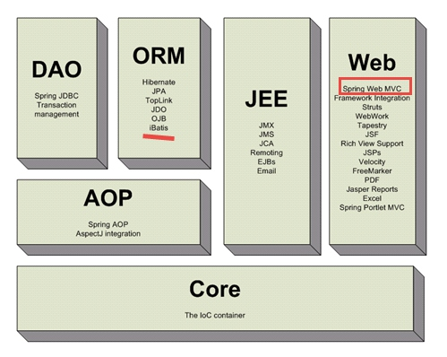
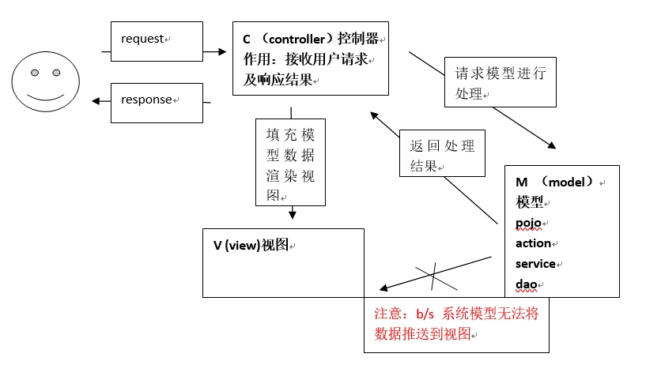
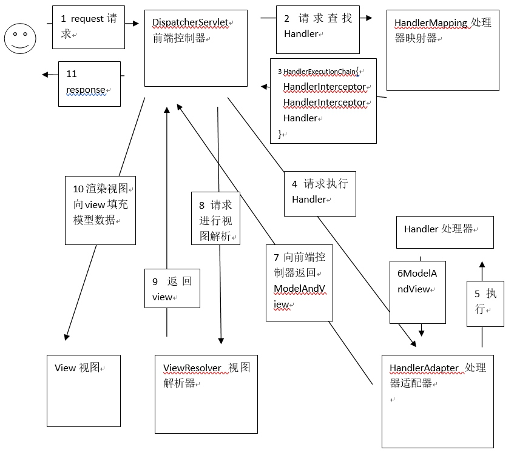
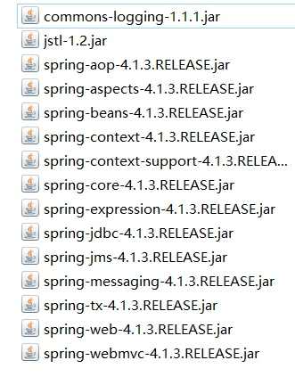
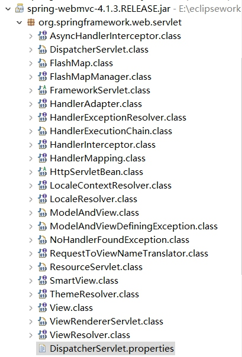

# SpringMVC
## SpringMVC框架
- SpringMVC是Spring的一个模块，提供web层解决方案(基于mvc设计架构)


### MVC在B/S系统的应用
- MVC是一个设计模式，在B/S系统的应用


### SpringMVC的框架


1. 用户发起request请求，请求至DispatcherServlet前端控制器
2. DispatcherServlet前端控制器请求HandlerMapping处理器映射器查找Handler
    - DispatcherServlet:前端控制器，相当于中央调度器，各个组件都和前端控制器进行交互，降低了各个组件之间的耦合度
3. HandlerMapping处理器映射器，根据url及一些配置规则(xml配置、注解配置)查找Handler，将Handler返回给DispatcherServlet前端控制器
4. DispatcherServlet前端控制器调用适配器执行Handler，有了适配器，通过适配器去扩展对不同Handler执行方式(比如原始servlet开发，注解开发)
5. 适配器执行Handler
    - Handler是后端控制器
6. Handler执行完成返回ModelAndView
    - ModelAndView:SpringMVC的一个对象，对model和view进行封装
7. 适配器将ModelAndView返回给DispatcherServlet
8. DispatcherServlet调用视图解析器进行视图解析，解析后生成view，视图解析器根据逻辑视图名解析出真正的视图。
    - View:SpringMVC视图封装对象，提供了很多view，jsp、freemarker、pdf
9. ViewResolver视图解析器给前端控制器返回view
10. DispatcherServlet调用view的渲染视图的方法，将模型数据填充到request域。
11. DispatcherServlet向用户响应结果(jsp页面、json数据)

- DispatcherServlet:前端控制器，由SpringMVC提供
- HandlerMapping:处理器映射器，由SpringMVC提供
- HandlerAdapter:处理器适配器，由SpringMVC提供
- **Handler:处理器，需要程序员编写**
- ViewResolver:视图解析器，由SpringMVC提供
- **View:真正视图页面需要由程序员编写**
## 入门程序
### 需求
- 实现商品列表查询
### 需要的jar包
使用spring4.1.3(带spring-webmvc模块)



### 前端控制器
在web.xml中配置  
```xml
<!-- 配置springMVC前台控制器，核心 -->
  <servlet>
  	<servlet-name>springmvc</servlet-name>
  	<servlet-class>org.springframework.web.servlet.DispatcherServlet</servlet-class>
  	
  	<!-- 加载springmvc配置文件 -->
  	<init-param>
  		<param-name>contextConfigLocation</param-name>
  		<!-- 
  			配置文件地址
  			如果不配置contextConfigLocation，
  			默认查找的配置文件名称classpath下的servlet名称+"-servlet.xml"即springmvc-servlet.xml
  		 -->
  		<param-value>classpath:springmvc.xml</param-value>
  	</init-param>
  </servlet>
  
  <!-- 
  	可以配置/，此工程所有请求全部由springmvc解析，此种方式可以实现RESTful方式，需要特殊处理，对静态文件的解析不能由springmvc
  	可以配置*.do或*.action，所有请求的url扩展名为.do或.action由springmvc解析，此种方法常用
  	 不可以配置/*,如果配置/*，返回jsp也由springmvc解析，这是不对的
   -->
  <servlet-mapping>
  	<servlet-name>springmvc</servlet-name>
  	<url-pattern>*.action</url-pattern>
  </servlet-mapping>
```
### springmvc.xml
- 在springmvc.xml中配置springmvc架构三大组件(处理器映射器、适配器、视图解析器)
### 处理器映射器
- 在springmvc.xml中配置:
    - BeanNameUrlHandlerMapping:根据请求url(xxx.action)匹配spring容器bean的name，找到对应的bean(程序编写的Handler)
```xml
<!-- 配置处理器映射器 
    	BeanNameUrlHandlerMapping： 根据请求url（XXXX.action）匹配spring容器bean的 name
		找到对应的bean（程序编写的Handler）
    -->  
    <bean class="org.springframework.web.servlet.handler.BeanNameUrlHandlerMapping"/>
```
**所有处理器映射器都实现HandlerMapping接口。**
### 处理器适配器
在springmvc.xml配置  
```xml
<!-- 配置处理器适配器 
    	程序编写Handler根据适配器的要求编写。
		SimpleControllerHandlerAdapter适配器要求：
		通过supports方法知道Handler必须要实现哪个接口
    -->
    <bean class="org.springframework.web.servlet.mvc.SimpleControllerHandlerAdapter"/>
```
**所有的适配器都是实现了HandlerAdapter接口。**  
- 程序编写Handler根据适配器的要求编写
- SimpleControllerHandlerAdapter适配器要求:
    - 通过supports方法知道Handler必须要实现那个接口
```java
@Override
	public boolean supports(Object handler) {
		return (handler instanceof Controller);
	}
```
### Handler编写
- 需要实现Controller接口
```java
public class ItemController1 implements Controller {

	@Override
	public ModelAndView handleRequest(HttpServletRequest request, HttpServletResponse response) throws Exception {
		
		// 商品列表
		List<Items> itemsList = new ArrayList<Items>();

		Items items_1 = new Items();
		items_1.setName("联想笔记本a");
		items_1.setPrice(6000f);
		items_1.setCreatetime(new Date());
		items_1.setDetail("ThinkPad T430 联想笔记本电脑！");

		Items items_2 = new Items();
		items_2.setName("苹果手机");
		items_2.setPrice(5000f);
		items_2.setDetail("iphone5  苹果手机！");
		
		Items items_3 = new Items();
		items_2.setName("苹果手机qqq");
		items_2.setPrice(5000f);
		items_2.setDetail("iphone5  苹果手机！");

		itemsList.add(items_1);
		itemsList.add(items_2);
		itemsList.add(items_3);

		//将数据存到request中
		//request.setAttribute("itemsList", itemsList);
		//可以使用ModelAndView对象，能够往request中存数据也可以实现转发
		ModelAndView modelAndView = new ModelAndView();
		modelAndView.addObject("itemsList", itemsList);
		
		//转到指定视图
		modelAndView.setViewName("/WEB-INF/jsp/itemsList.jsp");
		return modelAndView;
	}
}
```
### 配置Handler
- 在springmvc.xml配置Handler由spring管理Handler。
```xml
<!-- 配置handler
    	使用了BeanNameUrlHandlerMapping映射处理器，handler的name为浏览器访问的url
     -->
    <bean id="itemController1" name="/itemsList.action" class="vvr.springmvc.first.ItemController1"/>
```
### 配置视图解析器
- 配置视图解析，能够解析jsp视图
```xml
<!-- 配置视图解析器 
    	要求将jstl包加到classpath下
    -->
    <bean class="org.springframework.web.servlet.view.InternalResourceViewResolver"/>
```
## 其它非注解处理器映射器和适配器
### BeanNameUrlHandlerMapping(映射器)
- 根据请求url(xxx.action)匹配spring容器bean的name
- 找到对应的bean(程序编写的Handler)
### SimpleUrlHandlerMapping(映射器)
- 集中配置bean的id对应的url
```xml
<!-- 配置另一个处理器映射器
    	简单url映射
    	集中配置bean的id对应的url
     -->
    <bean class="org.springframework.web.servlet.handler.SimpleUrlHandlerMapping">
    	<!-- mappings为SimpleUrlHandlerMapping该类提供的属性 -->
    	<property name="mappings">
    		<props>
    			<!-- key代表url，标签内为指定bean的id -->
    			<prop key="/itemsTest1.action">itemController1</prop>
    			<prop key="/itemsTest2.action">itemController2</prop>
    		</props>
    	</property>
    </bean>
```
- 在springmvc.xml配置了多个处理器映射器，多个处理器映射器可以共存。
### SimpleControllerHandlerAdapter(适配器)
- 要求程序编写的Handler(Controller)需要实现的Controller接口。
### HttpRequestHandlerAdapter(适配器)
#### 开发Handler
```java
public class ItemController2 implements HttpRequestHandler {

	@Override
	public void handleRequest(HttpServletRequest request, HttpServletResponse response) throws ServletException, IOException {
		
		// 商品列表
		List<Items> itemsList = new ArrayList<Items>();

		Items items_1 = new Items();
		items_1.setName("联想笔记本a");
		items_1.setPrice(6000f);
		items_1.setCreatetime(new Date());
		items_1.setDetail("ThinkPad T430 联想笔记本电脑！");

		Items items_2 = new Items();
		items_2.setName("苹果手机");
		items_2.setPrice(5000f);
		items_2.setDetail("iphone5  苹果手机！");
		
		itemsList.add(items_1);
		itemsList.add(items_2);

		request.setAttribute("itemsList", itemsList);
		request.getRequestDispatcher("/WEB-INF/jsp/itemsList.jsp").forward(request, response);
	}
}
```
#### 配置Handler
```xml
<bean id="itemController2" class="vvr.springmvc.first.ItemController2"/>
```
使用简单url映射器:  
```xml
<!-- 配置另一个处理器映射器
    	简单url映射
    	集中配置bean的id对应的url
     -->
    <bean class="org.springframework.web.servlet.handler.SimpleUrlHandlerMapping">
    	<!-- mappings为SimpleUrlHandlerMapping该类提供的属性 -->
    	<property name="mappings">
    		<props>
    			<!-- key代表url，标签内为指定bean的id -->
    			<prop key="/itemsTest1.action">itemController1</prop>
    			<prop key="/itemsTest2.action">itemController2</prop>
    		</props>
    	</property>
    </bean>
```
## DispatcherServlet.properties

  
- DispatcherServlet前端控制器加载DispatvherServlet.properties配置文件，从而默认加载各个组件。如果在springmvc.xml中配置了处理器映射器和适配器，则以springmvc.xml中配置的为准。
## 注解映射器和适配器
### 注解映射器
- 在springmvc.xml中配置RequestMappingHandlerMapping映射器
- 使用RequestMappingHandlerMapping需要在Handler中使用**@Controller**标识此类是一个控制器，使用**@RequestMapping**指定Handler方法所对应的url。
```xml
<!-- 配置注解处理器映射器 -->
<bean class="org.springframework.web.servlet.mvc.method.annotation.RequestMappingHandlerMapping"/>
```
### 注解适配器
- 在springmvc.xml中配置RequestMappingHandlerAdapter
- RequestMappingHandlerAdapter不需要Handler实现任何接口，它需要和RequestMappingHandlerMapping注解映射器配对使用，主要解析Handler方法中的形参。
```xml
<!-- 配置注解处理器适配器
	该适配器必须与RequestMappingHandlerMapping处理器映射器一起使用
 -->
<bean class="org.springframework.web.servlet.mvc.method.annotation.RequestMappingHandlerAdapter"/>
```
### 注解开发Handler
```java
@Controller
public class ItemController3 {
	//商品列表，@RequestMapping中的url建议与方法名相同
	//这里的url地址后可以不加.action,也可以加，但是，如果不加，在浏览器访问时需要加上
	@RequestMapping("/itemsList123.action")
	public ModelAndView itemsList() {
		
		// 商品列表
		List<Items> itemsList = new ArrayList<Items>();

		Items items_1 = new Items();
		items_1.setName("联想笔记本a");
		items_1.setPrice(6000f);
		items_1.setCreatetime(new Date());
		items_1.setDetail("ThinkPad T430 联想笔记本电脑！");

		Items items_2 = new Items();
		items_2.setName("苹果手机");
		items_2.setPrice(5000f);
		items_2.setDetail("iphone5  苹果手机！");
		

		itemsList.add(items_1);
		itemsList.add(items_2);
		
		ModelAndView modelAndView = new ModelAndView();
		modelAndView.addObject("itemsList", itemsList);
		modelAndView.setViewName("/WEB-INF/jsp/itemsList.jsp");
		
		return modelAndView;
	}
}
```
### 配置Handler
```xml
<!-- 配置使用注解写的Handler
    	如果有多个Handler，就需要配置多个
     -->
    <!-- <bean class="vvr.springmvc.first.ItemController3" /> -->
    
    <!-- 开启注解扫描，使用spring组件扫描，即可不需要配置多个Handler
    	多个包之间用逗号隔开
     -->
    <context:component-scan base-package="vvr.springmvc.first"/>
```
### 小结
- DispatcherServlet:前端控制器，相当于中央调度器，可以降低组件之间的耦合度
- HandlerMapping:处理器映射器，负责根据url查找Handler
- HandlerAdapter:处理器适配器，负责根据适配器要求的规则去执行处理器。可以通过扩展适配器支持不同类型的Handler。
- viewResolver:视图解析器，根据逻辑视图名解析出真正的视图
```xml
<!-- 配置视图解析器 
    	要求将jstl包加到classpath下
    -->
    <bean class="org.springframework.web.servlet.view.InternalResourceViewResolver">
    	<!-- 配置逻辑视图名的前缀和后缀 -->
    	<!-- 前缀 -->
    	<property name="prefix" value="/WEB-INF/jsp/"/>
    	
    	<!-- 后缀 -->
    	<property name="suffix" value=".jsp"/>
    </bean>
```
**真正视图地址=前缀+逻辑视图名+后缀**

