# SpringMVC
## SpringMVC框架

- SpringMVC是Spring的一个模块，提供web层解决方案(基于mvc设计架构)


### MVC在B/S系统的应用
- MVC是一个设计模式，在B/S系统的应用


### SpringMVC的框架


1. 用户发起request请求，请求至DispatcherServlet前端控制器
2. DispatcherServlet前端控制器请求HandlerMapping处理器映射器查找Handler
    - DispatcherServlet:前端控制器，相当于中央调度器，各个组件都和前端控制器进行交互，降低了各个组件之间的耦合度
3. HandlerMapping处理器映射器，根据url及一些配置规则(xml配置、注解配置)查找Handler，将Handler返回给DispatcherServlet前端控制器
4. DispatcherServlet前端控制器调用适配器执行Handler，有了适配器，通过适配器去扩展对不同Handler执行方式(比如原始servlet开发，注解开发)
5. 适配器执行Handler
    - Handler是后端控制器
6. Handler执行完成返回ModelAndView
    - ModelAndView:SpringMVC的一个对象，对model和view进行封装
7. 适配器将ModelAndView返回给DispatcherServlet
8. DispatcherServlet调用视图解析器进行视图解析，解析后生成view，视图解析器根据逻辑视图名解析出真正的视图。
    - View:SpringMVC视图封装对象，提供了很多view，jsp、freemarker、pdf
9. ViewResolver视图解析器给前端控制器返回view
10. DispatcherServlet调用view的渲染视图的方法，将模型数据填充到request域。
11. DispatcherServlet向用户响应结果(jsp页面、json数据)

- DispatcherServlet:前端控制器，由SpringMVC提供
- HandlerMapping:处理器映射器，由SpringMVC提供
- HandlerAdapter:处理器适配器，由SpringMVC提供
- **Handler:处理器，需要程序员编写**
- ViewResolver:视图解析器，由SpringMVC提供
- **View:真正视图页面需要由程序员编写**
## 入门程序
### 需求

- 实现商品列表查询
### 需要的jar包
使用spring4.1.3(带spring-webmvc模块)


### 前端控制器
在web.xml中配置  
```xml
<!-- 配置springMVC前台控制器，核心 -->
  <servlet>
  	<servlet-name>springmvc</servlet-name>
  	<servlet-class>org.springframework.web.servlet.DispatcherServlet</servlet-class>
  	
  	<!-- 加载springmvc配置文件 -->
  	<init-param>
  		<param-name>contextConfigLocation</param-name>
  		<!-- 
  			配置文件地址
  			如果不配置contextConfigLocation，
  			默认查找的配置文件名称classpath下的servlet名称+"-servlet.xml"即springmvc-servlet.xml
  		 -->
  		<param-value>classpath:springmvc.xml</param-value>
  	</init-param>
  </servlet>
  
  <!-- 
  	可以配置/，此工程所有请求全部由springmvc解析，此种方式可以实现RESTful方式，需要特殊处理，对静态文件的解析不能由springmvc
  	可以配置*.do或*.action，所有请求的url扩展名为.do或.action由springmvc解析，此种方法常用
  	 不可以配置/*,如果配置/*，返回jsp也由springmvc解析，这是不对的
   -->
  <servlet-mapping>
  	<servlet-name>springmvc</servlet-name>
  	<url-pattern>*.action</url-pattern>
  </servlet-mapping>
```
### springmvc.xml
- 在springmvc.xml中配置springmvc架构三大组件(处理器映射器、适配器、视图解析器)
### 处理器映射器
- 在springmvc.xml中配置:
    - BeanNameUrlHandlerMapping:根据请求url(xxx.action)匹配spring容器bean的name，找到对应的bean(程序编写的Handler)
```xml
<!-- 配置处理器映射器 
    	BeanNameUrlHandlerMapping： 根据请求url（XXXX.action）匹配spring容器bean的 name
		找到对应的bean（程序编写的Handler）
    -->  
    <bean class="org.springframework.web.servlet.handler.BeanNameUrlHandlerMapping"/>
```
**所有处理器映射器都实现HandlerMapping接口。**
### 处理器适配器
在springmvc.xml配置  
```xml
<!-- 配置处理器适配器 
    	程序编写Handler根据适配器的要求编写。
		SimpleControllerHandlerAdapter适配器要求：
		通过supports方法知道Handler必须要实现哪个接口
    -->
    <bean class="org.springframework.web.servlet.mvc.SimpleControllerHandlerAdapter"/>
```
**所有的适配器都是实现了HandlerAdapter接口。**  
- 程序编写Handler根据适配器的要求编写
- SimpleControllerHandlerAdapter适配器要求:
    - 通过supports方法知道Handler必须要实现那个接口
```java
@Override
	public boolean supports(Object handler) {
		return (handler instanceof Controller);
	}
```
### Handler编写
- 需要实现Controller接口
```java
public class ItemController1 implements Controller {

	@Override
	public ModelAndView handleRequest(HttpServletRequest request, HttpServletResponse response) throws Exception {
		
		// 商品列表
		List<Items> itemsList = new ArrayList<Items>();

		Items items_1 = new Items();
		items_1.setName("联想笔记本a");
		items_1.setPrice(6000f);
		items_1.setCreatetime(new Date());
		items_1.setDetail("ThinkPad T430 联想笔记本电脑！");

		Items items_2 = new Items();
		items_2.setName("苹果手机");
		items_2.setPrice(5000f);
		items_2.setDetail("iphone5  苹果手机！");
		
		Items items_3 = new Items();
		items_2.setName("苹果手机qqq");
		items_2.setPrice(5000f);
		items_2.setDetail("iphone5  苹果手机！");

		itemsList.add(items_1);
		itemsList.add(items_2);
		itemsList.add(items_3);

		//将数据存到request中
		//request.setAttribute("itemsList", itemsList);
		//可以使用ModelAndView对象，能够往request中存数据也可以实现转发
		ModelAndView modelAndView = new ModelAndView();
		modelAndView.addObject("itemsList", itemsList);
		
		//转到指定视图
		modelAndView.setViewName("/WEB-INF/jsp/itemsList.jsp");
		return modelAndView;
	}
}
```
### 配置Handler
- 在springmvc.xml配置Handler由spring管理Handler。
```xml
<!-- 配置handler
    	使用了BeanNameUrlHandlerMapping映射处理器，handler的name为浏览器访问的url
     -->
    <bean id="itemController1" name="/itemsList.action" class="vvr.springmvc.first.ItemController1"/>
```
### 配置视图解析器
- 配置视图解析，能够解析jsp视图
```xml
<!-- 配置视图解析器 
    	要求将jstl包加到classpath下
    -->
    <bean class="org.springframework.web.servlet.view.InternalResourceViewResolver"/>
```
## 其它非注解处理器映射器和适配器
### BeanNameUrlHandlerMapping(映射器)
- 根据请求url(xxx.action)匹配spring容器bean的name
- 找到对应的bean(程序编写的Handler)
### SimpleUrlHandlerMapping(映射器)
- 集中配置bean的id对应的url
```xml
<!-- 配置另一个处理器映射器
    	简单url映射
    	集中配置bean的id对应的url
     -->
    <bean class="org.springframework.web.servlet.handler.SimpleUrlHandlerMapping">
    	<!-- mappings为SimpleUrlHandlerMapping该类提供的属性 -->
    	<property name="mappings">
    		<props>
    			<!-- key代表url，标签内为指定bean的id -->
    			<prop key="/itemsTest1.action">itemController1</prop>
    			<prop key="/itemsTest2.action">itemController2</prop>
    		</props>
    	</property>
    </bean>
```
- 在springmvc.xml配置了多个处理器映射器，多个处理器映射器可以共存。
### SimpleControllerHandlerAdapter(适配器)
- 要求程序编写的Handler(Controller)需要实现的Controller接口。
### HttpRequestHandlerAdapter(适配器)
#### 开发Handler
```java
public class ItemController2 implements HttpRequestHandler {

	@Override
	public void handleRequest(HttpServletRequest request, HttpServletResponse response) throws ServletException, IOException {
		
		// 商品列表
		List<Items> itemsList = new ArrayList<Items>();

		Items items_1 = new Items();
		items_1.setName("联想笔记本a");
		items_1.setPrice(6000f);
		items_1.setCreatetime(new Date());
		items_1.setDetail("ThinkPad T430 联想笔记本电脑！");

		Items items_2 = new Items();
		items_2.setName("苹果手机");
		items_2.setPrice(5000f);
		items_2.setDetail("iphone5  苹果手机！");
		
		itemsList.add(items_1);
		itemsList.add(items_2);

		request.setAttribute("itemsList", itemsList);
		request.getRequestDispatcher("/WEB-INF/jsp/itemsList.jsp").forward(request, response);
	}
}
```
#### 配置Handler
```xml
<bean id="itemController2" class="vvr.springmvc.first.ItemController2"/>
```
使用简单url映射器:  
```xml
<!-- 配置另一个处理器映射器
    	简单url映射
    	集中配置bean的id对应的url
     -->
    <bean class="org.springframework.web.servlet.handler.SimpleUrlHandlerMapping">
    	<!-- mappings为SimpleUrlHandlerMapping该类提供的属性 -->
    	<property name="mappings">
    		<props>
    			<!-- key代表url，标签内为指定bean的id -->
    			<prop key="/itemsTest1.action">itemController1</prop>
    			<prop key="/itemsTest2.action">itemController2</prop>
    		</props>
    	</property>
    </bean>
```
## DispatcherServlet.properties

  
- DispatcherServlet前端控制器加载DispatvherServlet.properties配置文件，从而默认加载各个组件。如果在springmvc.xml中配置了处理器映射器和适配器，则以springmvc.xml中配置的为准。
## 注解映射器和适配器
### 注解映射器
- 在springmvc.xml中配置RequestMappingHandlerMapping映射器
- 使用RequestMappingHandlerMapping需要在Handler中使用**@Controller**标识此类是一个控制器，使用**@RequestMapping**指定Handler方法所对应的url。
```xml
<!-- 配置注解处理器映射器 -->
<bean class="org.springframework.web.servlet.mvc.method.annotation.RequestMappingHandlerMapping"/>
```
### 注解适配器
- 在springmvc.xml中配置RequestMappingHandlerAdapter
- RequestMappingHandlerAdapter不需要Handler实现任何接口，它需要和RequestMappingHandlerMapping注解映射器配对使用，主要解析Handler方法中的形参。
```xml
<!-- 配置注解处理器适配器
	该适配器必须与RequestMappingHandlerMapping处理器映射器一起使用
 -->
<bean class="org.springframework.web.servlet.mvc.method.annotation.RequestMappingHandlerAdapter"/>
```
### 注解开发Handler

```java
@Controller
public class ItemController3 {
	//商品列表，@RequestMapping中的url建议与方法名相同
	//这里的url地址后可以不加.action,也可以加，但是，如果不加，在浏览器访问时需要加上
	@RequestMapping("/itemsList123.action")
	public ModelAndView itemsList() {
		
		// 商品列表
		List<Items> itemsList = new ArrayList<Items>();

		Items items_1 = new Items();
		items_1.setName("联想笔记本a");
		items_1.setPrice(6000f);
		items_1.setCreatetime(new Date());
		items_1.setDetail("ThinkPad T430 联想笔记本电脑！");

		Items items_2 = new Items();
		items_2.setName("苹果手机");
		items_2.setPrice(5000f);
		items_2.setDetail("iphone5  苹果手机！");
		

		itemsList.add(items_1);
		itemsList.add(items_2);
		
		ModelAndView modelAndView = new ModelAndView();
		modelAndView.addObject("itemsList", itemsList);
		modelAndView.setViewName("/WEB-INF/jsp/itemsList.jsp");
		
		return modelAndView;
	}
}
```
### 配置Handler
```xml
<!-- 配置使用注解写的Handler
    	如果有多个Handler，就需要配置多个
     -->
    <!-- <bean class="vvr.springmvc.first.ItemController3" /> -->
    
    <!-- 开启注解扫描，使用spring组件扫描，即可不需要配置多个Handler
    	多个包之间用逗号隔开
     -->
    <context:component-scan base-package="vvr.springmvc.first"/>
```
### 小结
- DispatcherServlet:前端控制器，相当于中央调度器，可以降低组件之间的耦合度
- HandlerMapping:处理器映射器，负责根据url查找Handler
- HandlerAdapter:处理器适配器，负责根据适配器要求的规则去执行处理器。可以通过扩展适配器支持不同类型的Handler。
- viewResolver:视图解析器，根据逻辑视图名解析出真正的视图
```xml
<!-- 配置视图解析器 
    	要求将jstl包加到classpath下
    -->
    <bean class="org.springframework.web.servlet.view.InternalResourceViewResolver">
    	<!-- 配置逻辑视图名的前缀和后缀 -->
    	<!-- 前缀 -->
    	<property name="prefix" value="/WEB-INF/jsp/"/>
    	
    	<!-- 后缀 -->
    	<property name="suffix" value=".jsp"/>
    </bean>
```
**真正视图地址=前缀+逻辑视图名+后缀**
## SpringMVC和MyBatis整合工程搭建
### 整合思路
- 在mybatis和spring整合的基础上添加springmvc
- spring要管理springmvc编写Handler(controller)、mybatis的SqlSessionFactory、mapper
1. 整合dao，spring和mybatis整合
2. 整合service，spring管理service接口，service中可以调用spring容器中dao(mapper)
3. 整合controller，spring管理controller接口，在controller调用service
### 工程结构
#### 配置文件
- applicationContext-dao.xml:配置数据源、SqlSessionFactory、mapper扫描器
- applicationContext-service.xml:配置service接口                                                               
- applicationContext-transaction.xml:事务管理
- springmvc.xml:springmvc的配置，配置处理器映射器、适配器、视图解析器
- SqlMapConfig.xml:mybatis的配置文件，配置别名、settings、mapper(也可在applicationContext中使用注解扫描来配置)
#### applicationContext-dao.xml
配置mybatis的数据源、sqlSessionFactory、mapper扫描器
#### applicationContext-transaction.xml
在此配置事务，声明事务  
```xml
<!-- 事务管理器 -->
	<bean id="transactionManager" class="org.springframework.jdbc.datasource.DataSourceTransactionManager">
		<property name="dataSource" ref="dataSource"/>
	</bean>
	
	<!-- 通知 -->
	<tx:advice id="txAdvice" transaction-manager="transactionManager">
		<tx:attributes>
			<tx:method name="save*" propagation="REQUIRED"/>
			<tx:method name="delete*" propagation="REQUIRED"/>
			<tx:method name="insert*" propagation="REQUIRED"/>
			<tx:method name="update*" propagation="REQUIRED"/>
			<tx:method name="find*" propagation="SUPPORTS" read-only="true"/>
			<tx:method name="select*" propagation="SUPPORTS" read-only="true"/>
			<tx:method name="get*" propagation="SUPPORTS" read-only="true"/>
		</tx:attributes>
	</tx:advice>
	
	
	<!-- AOP -->
	<aop:config>
		<!-- 切入点表达式，vvr.ssm.service包下的任意类的任意方法的任意参数 -->
		<aop:advisor advice-ref="txAdvice" pointcut="execution(* vvr.ssm.service.*.*(..))"/>
	</aop:config>
```
#### 前端控制器配置
在web.xml中配置  
```xml
<!-- 配置springMVC前端控制器，核心 -->
  <servlet>
  	<servlet-name>springmvc</servlet-name>
  	<servlet-class>org.springframework.web.servlet.DispatcherServlet</servlet-class>
  	
  	<!-- 加载springmvc配置文件 -->
  	<init-param>
  		<param-name>contextConfigLocation</param-name>
  		<param-value>classpath:spring/springmvc.xml</param-value>
  	</init-param>
  </servlet>
  
 
  <servlet-mapping>
  	<servlet-name>springmvc</servlet-name>
  	<url-pattern>*.action</url-pattern>
  </servlet-mapping>
```
#### 配置springmvc.xml
```xml
<!-- 开启注解扫描，使用spring组件扫描，即可不需要配置多个Handler
    	多个包之间用逗号隔开
     -->
    <context:component-scan base-package="vvr.ssm.controller"/>
    
    <!-- 使用annotation-driven可以替代下面的映射器和处理器的配置 -->
    <!-- <mvc:annotation-driven></mvc:annotation-driven> -->
    
    <!-- 配置注解处理器映射器 -->
    <bean class="org.springframework.web.servlet.mvc.method.annotation.RequestMappingHandlerMapping"/>
    
    
    <!-- 配置注解处理器适配器
    	该适配器必须与RequestMappingHandlerMapping处理器映射器一起使用
     -->
    <bean class="org.springframework.web.servlet.mvc.method.annotation.RequestMappingHandlerAdapter"/>
    
    
    <!-- 配置视图解析器 
    	要求将jstl包加到classpath下
    -->
    <bean class="org.springframework.web.servlet.view.InternalResourceViewResolver">
    	<!-- 配置逻辑视图名的前缀和后缀 -->
    	<!-- 前缀 -->
    	<property name="prefix" value="/WEB-INF/jsp/"/>
    	
    	<!-- 后缀 -->
    	<property name="suffix" value=".jsp"/>
    </bean>
```
#### 配置spring
在web.xml中配置  
```xml
<!-- 配置spring -->
  <listener>
  	<listener-class>org.springframework.web.context.ContextLoaderListener</listener-class>
  </listener>
  
  <!-- 加载方式:默认只能加载WEB-INF目录下的配置文件，提供配置方法，加载src目录下的，写法固定 -->
  <context-param>
  	<param-name>contextConfigLocation</param-name>
  	<param-value>classpath:spring/applicationContext-*.xml</param-value>
  </context-param>
```
### 商品列表开发
#### 需求
- 查询商品列表
#### mapper
- 功能描述:根据条件查询商品信息，返回商品列表
- 一般情况下针对查询mapper需要自定义mapper，首先针对单表进行逆向工程，生成代码。
##### mapper.xml
```xml
<mapper namespace="vvr.ssm.mapper.ItemsMapperCustom">
	
	<sql id="query_items_where">
		<if test="itemsCustom!=null">
			<if test="itemsCustom.name!=null and itemsCustom.name!=''">
				and name like '%${itemsCustom.name}%'
			</if>
			<if test="itemsCustom.id!=null">
				and id = #{itemsCustom.id}
			</if>
		</if>
	</sql>
	
	<!-- 根据条件查询商品 -->
	<select id="findItemsList" parameterType="itemsQueryVo" resultType="itemsCustom">
		SELECT * FROM items
		<where>
			<include refid="query_items_where"/>
		</where>
	</select>
</mapper>
```
#### 包装类
```java
public class ItemsQueryVo {

	private ItemsCustom itemsCustom;

	public ItemsCustom getItemsCustom() {
		return itemsCustom;
	}

	public void setItemsCustom(ItemsCustom itemsCustom) {
		this.itemsCustom = itemsCustom;
	}
}
```
#### mapper.java
```java
//查询商品
	public List<ItemsCustom> findItemsList(ItemsQueryVo itemsQueryVo) throws Exception;
```
#### service
```java
public class ItemsServiceImpl implements ItemsService {

	//需要注入dao，使用注解注入，还需要在spring配置文件中配置service
	//因为dao是通过扫描mapper代理生成，所有没有在配置文件中定义相应的bean
	//所以配置service时，没法使用property注入，所以采用注解注入
	@Autowired
	private ItemsMapperCustom itemsMapperCustom;

	@Override
	public List<ItemsCustom> findItemsList(ItemsQueryVo itemsQueryVo) throws Exception {
		
		return itemsMapperCustom.findItemsList(itemsQueryVo);
	}
```
#### 在applicationContext-service.xml中配置service
```xml
 <!-- 商品管理的service -->
	<bean id="itemsService" class="vvr.ssm.service.impl.ItemsServiceImpl" />
```
#### controller
```java
@Controller
public class ItemsController {
	
	//注入service，同样使用注解
	@Autowired
	private ItemsService itemsService;

	@RequestMapping("/queryItems.action")
	public ModelAndView queryItems() throws Exception {
		
		ModelAndView modelAndView = new ModelAndView();
		
		List<ItemsCustom> itemsList = itemsService.findItemsList(null);
		modelAndView.addObject("itemsList", itemsList);
		
	modelAndView.setViewName("itemsList");
		
		return modelAndView;
	}
}
```
## 注解开发基础
### 商品修改
#### 需求
- 功能描述:商品信息修改
- 操作流程
    - 在商品列表页面点击修改链接
    - 打开商品修改页面，显示当前商品信息，根据商品id查询商品信息
    - 修改商品信息，点击提交，更新商品信息
#### mapper
- 使用逆向工程生成代码:
    - 根据商品id查询商品信息
    - 更新商品信息
#### service
```java
@Override
	public ItemsCustom findItemById(Integer id) throws Exception {
		
		//根据id查询出商品信息
		Items item = itemsMapper.selectByPrimaryKey(id);
		
		//由于返回的是扩展类，而且随着需求的变更，如果想要获得商品的其他信息，就会需要使用扩展类
		ItemsCustom itemsCustom = new ItemsCustom();
		//将items的属性拷贝到itemCustomer中
		BeanUtils.copyProperties(item, itemsCustom);
		
		return itemsCustom;
	}

	@Override
	public void updateItem(Integer id, ItemsCustom itemsCustom) throws Exception {

		//对于关键数据的非空校验
		if(id == null) {
			// 抛出异常，提示调用接口的用户
		}
		
		//不能修改大文本数据
		//itemsMapper.updateByPrimaryKey(itemsCustom);
		
		//可以修改大文本数据
itemsMapper.updateByPrimaryKeyWithBLOBs(itemsCustom);
	}
```
## @RequestMapping注解
### 设置方法对应的url(完成url映射)
- 一个方法对应一个url
```java
@RequestMapping("/queryItems.action")
	public ModelAndView queryItems() throws Exception {
```
### 窄化请求映射
- 在class上定义根路径
```java
/定义url的根路径，访问时使用根路径+方法的url
@RequestMapping("/items")
public class ItemsController {
```
- 好处:更新规范系统的url，避免url冲突。
### 限制http请求的方法
- 通过requestMapping限制url请求的http方法
- 如果限制请求必须是post，那么，如果是get请求就会抛出异常

```java
@RequestMapping(value = "/editItem",method = {RequestMethod.GET,RequestMethod.POST})
```
## controller方法返回值
### 返回ModelAndView
```java
@RequestMapping("/queryItems.action")
	public ModelAndView queryItems() throws Exception {
		
		ModelAndView modelAndView = new ModelAndView();
		
		List<ItemsCustom> itemsList = itemsService.findItemsList(null);
		modelAndView.addObject("itemsList", itemsList);
		
		modelAndView.setViewName("itemsList");
		
		return modelAndView;
	}
```
### 返回字符串
如果controller方法返回jsp页面，可以简单将方法返回值类型定义为字符串，最终返回逻辑视图名。  
```java
/**
	 * 
	 * @param model作用是将数据填充到request域，显示到界面
	 * @param id对应商品的id，需要与界面中指定的参数名相同才能完成参数绑定，如果不同，就使用@requestParam注解
	 * @return
	 * @throws Exception
	 * 方法返回字符串，字符串就是指定的逻辑视图名，返回的指定jsp页面
	 */
	@RequestMapping(value = "/editItem",method = {RequestMethod.GET,RequestMethod.POST})
	public String editItem(Model model,Integer id) throws Exception{
		
		
		ItemsCustom itemsCustom = itemsService.findItemById(id);
		
		model.addAttribute("item", itemsCustom);
		
		//return "editItem_2";
		return "editItem";
	}
```
### 返回void
```java
@RequestMapping(value = "/editItem",method = {RequestMethod.GET,RequestMethod.POST})
	public void editItem(HttpServletRequest request,HttpServletResponse response
			
			,@RequestParam(value="id",required=true,defaultValue="1")Integer id) throws Exception{
		
		ItemsCustom itemsCustom = itemsService.findItemById(id);
		
		request.setAttribute("item", itemsCustom);
		
		request.getRequestDispatcher("/WEB-INF/jsp/editItem.jsp").forward(request, response);
	}
```
- 使用此方法，容易输出json、xml格式的数据:
    - 通过response指定响应结果
### redirect重定向
- 如果方法重定向到另一个url，方法返回值为`redirect:url路径`
- 使用redirect进行重定向，request数据无法共享，url地址栏会发生变化。
### forward转发
- 如果forward进行请求转发，request数据就可以共享，url地址栏不会变化。
- 方法返回值为:`forward:url路径`
## 参数绑定
### 参数绑定过程

### 默认支持的参数类型
处理器形参中添加如下类型的参数，处理适配器会默认识别并进行赋值。  
#### HttpServletRequest
- 通过request对象获取请求信息
#### HttpServletResponse
- 通过response处理响应信息
#### HttpSession
- 通过session对象得到session中存放的对象
#### Model
- 通过model向页面传递数据
### @RequestParam注解
- 如果request请求的参数名和controller方法的形参名称一致，适配器自动进行参数绑定。如果不一致可以通过@RequestParam指定request请求的参数名绑定到哪个方法形参上。
- 对于必须要传的参数，通过@RequestParam中属性required设置为true，如果不传参数则报错。
- 对于有些参数如果不传入，还需要设置默认值，使用@RequestParam中属性defaultValue设置默认值。
### 可以绑定简单类型
可以绑定整型、字符型、单精度/双精度、日期、布尔型
### 可以绑定简单pojo类型
- 简单pojo类型只包括简单类型的属性。
- 绑定过程
    - request请求的参数名称和pojo的属性名一致，就可以绑定成功。
### 可以绑定包装的pojo
- 包装的pojo里包括了pojo
- 页面参数定义:
```jsp
<td>商品名称</td>
	<td><input type="text" name="itemsCustom.name" value="${item.name }"/></td>
```
- 注意name属性的值
- 包装类型的属性也是itemsCustom
### 自定义绑定使用属性编辑器
- SpringMVC没有提供默认的对日期类型的绑定，需要自定义日期类型的绑定。
#### 使用WebDataBinder(了解)
在controller类中定义:  
  
使用这种方法问题是无法在多个controller共用。  
#### 使用WebBindingInitializer(了解)
- 使用WebBindingInitializer让多个controller共用属性编辑器。
- 自定义WebBindingInitializer，注入到处理器适配器中。
- 如果想多个controller需要共同注册相同的属性编辑器，可以实现PropertyEditorRegistrar接口，并注入webBindingInitializer中。
- 编写CustomPropertyEditor:

- 配置如下
```xml
<!-- 注册属性编辑器，程序员自己编写的属性编辑器 -->
	<bean id="customPropertyEditor" class="cn.itcast.ssm.propertyeditor.CustomPropertyEditor"></bean> 

<!-- 自定义webBinder，spring提供，程序员需要注入 -->
	<bean id="customBinder"
		class="org.springframework.web.bind.support.ConfigurableWebBindingInitializer">
		<property name="propertyEditorRegistrars">
			<list>
				<ref bean="customPropertyEditor"/>
			</list>
		</property>
	</bean>

<!--注解适配器 -->
	<bean
		class="org.springframework.web.servlet.mvc.method.annotation.RequestMappingHandlerAdapter">
		 <property name="webBindingInitializer" ref="customBinder"></property> 
	</bean>
```
### 自定义参数绑定使用转换器
#### 自定义Converter
- 自定义日期类型转换器，需要实现Converter<S，T>
    - 这里的泛型，S代表原始值得类型
    - T代表想要转换的接口
    - 实现convert()方法
```java
/**
 * 字符串转日期类型
 * springmvc本身没有对日期类型参数做处理，需要程序员自己解决，指定时间显示格式
 * @author wwr
 *
 */
public class CustomerDateConverter implements Converter<String, Date> {

	@Override
	public Date convert(String source) {
		
		try {
			//将指定字符串转成日期格式，还需要在配置文件中配置该类
			return new SimpleDateFormat("yyyy-MM-dd HH:mm:ss").parse(source);
		} catch (ParseException e) {
			e.printStackTrace();
		}
		return null;
	}
}
```
#### 配置方式1
- 针对配置文件中不使用<mvc:annotation-driven>
```xml
<!-- 配置注解处理器适配器
    	该适配器必须与RequestMappingHandlerMapping处理器映射器一起使用
     -->
    <bean class="org.springframework.web.servlet.mvc.method.annotation.RequestMappingHandlerAdapter">
    	<!-- 在注解适配器中注入Converter转换器 -->
    	<property name="webBindingInitializer" ref="customerBinder"/>
    </bean>
    
    <!-- 自定义webBinder -->
    <bean id="customerBinder" class="org.springframework.web.bind.support.ConfigurableWebBindingInitializer">
    	<!-- 注入转换器 -->
    	<property name="conversionService" ref="conversionService"/>
    </bean>
    
    <!-- conversionService -->
    <bean id="conversionService" class="org.springframework.format.support.FormattingConversionServiceFactoryBean">
    	<property name="converters">
    		<list>
    			<!-- list集合代表可以注入多个自定义的转换器，converter是springMVC后期常用的 -->
    			<bean class="vvr.ssm.controller.converter.CustomerDateConverter"/>
    			<bean class="vvr.ssm.controller.converter.StringTrimConverter"/>
    		</list>
    	</property>
    </bean>
```
#### 配置方式2
- 针对使用<mvc:annotation-driven>的配置
```xml
<mvc:annotation-driven conversion-service="conversionService">
</mvc:annotation-driven>
<!-- conversionService -->
	<bean id="conversionService"
		class="org.springframework.format.support.FormattingConversionServiceFactoryBean">
		<!-- 转换器 -->
		<property name="converters">
			<list>
				<bean class="vvr.ssm.controller.converter.CustomerDateConverter"/>
			</list>
		</property>
	</bean>
```
## 问题处理
### post乱码
- 在web.xml中加入
```xml
<!-- 解决post乱码 -->
  <filter>
	<filter-name>CharacterEncodingFilter</filter-name>
	<filter-class>org.springframework.web.filter.CharacterEncodingFilter</filter-class>
	<init-param>
	<param-name>encoding</param-name>
	<param-value>utf-8</param-value>
	</init-param>
  </filter>
  <filter-mapping>
	<filter-name>CharacterEncodingFilter</filter-name>
	<url-pattern>/*</url-pattern>
  </filter-mapping>
```
以上可以解决post请求乱码问题。  
- 对于get请求中文参数出现乱码解决方法有两个:
    - 修改Tomcat配置文件添加编码与工程编码一致
    - `<Connector URIEncoding="utf-8" connectionTimeout="20000" port="8080" protocol="HTTP/1.1" redirectPort="8443"/>`
    - 另外一种方法对参数进行重新编码:
```java
String userName new;
String(request.getParamter("userName").getBytes("ISO8859-1"),"utf-8");
```
- ISO8859-1是Tomcat默认编码，需要将Tomcat编码后的内容按UTF-8编码。

## 数据回显

### 需求

表单提交出现错误，重新回到表单，用户重新填写数据，刚才提交的参数在页面上回显。

### 对简单类型的数据回显

对商品修改数据回显：

注意在进入修改页面的controller方法中和提交修改商品信息方法`model.addAttribute()`方法设置的key一致。

修改商品显示方法：

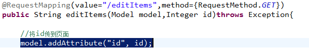

修改商品页面：

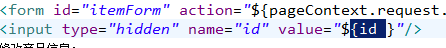

修改商品提交方法：

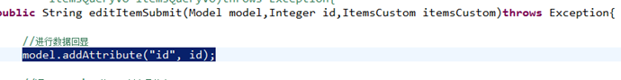

注意这里的key，也就是id，必须一致。

### pojo类型数据回显

#### 方法1

使用`model.addAttribute()`方法进行数据回显。

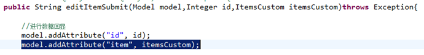

#### 方法2

使用@ModelAttribute，作用将请求pojo数据放到Model中回显到页面。

在ModelAttribute方法指定的名称就是要填充Model中的key，在页面中就要通过key取数据。

```java
/**
	 * 商品修改提交，使用返回字符串的方式，重定向或转发的方式返回action
	 * @param id商品的id
	 * @param itemCustom商品类，里面包含商品的简单数据类型，springmvc会找到该类中相同名称的属性
	 * @param itemsQueryVo包装数据类型，包含多个pojo类型，对应的，前台jsp表单的name属性需要加上对应的属性，例如itemsCustom.name
	 * @param @ModelAttribute(value="item") 中value指定的是key，该注解相当于model.addAttribute("item", itemsCustom);
	 * 		  存到request域中。可以完成数据回显的操作
	 * @return
	 * @throws Exception 
	 */
	@RequestMapping(value = "/editItemSubmit",method = {RequestMethod.GET,RequestMethod.POST})
	public String editItemSubmit(Integer id,@ModelAttribute(value="item") ItemsCustom itemsCustom
			,ItemsQueryVo itemsQueryVo) throws Exception {
		
		//执行修改
		itemsService.updateItem(id, itemsCustom);
		//itemsService.updateItem(id, itemsQueryVo.getItemsCustom());
		
		//重定向，以为是在同一个根路径下，所以可以不用加根路径
		//return "redirect:queryItems.action";
		
		//跳回到修改界面，查看数据回显
		return "editItem";
		
		//转发
		//return "forward:queryItems.action";
	}
```

### @ModelAttribute将方法返回值传到页面

- 需求：商品类别信息在商品信息页面显示。

```java
/**
	 * 使用@ModelAttribute将公用的数据的方法返回值传到页面，不用在每一个controller方法通过Model将数据传到页面。
	 * 不需要写url映射
	 * 在前台界面中用到了itemsType时就会显示出数据
	 * 商品类别属于不变的，公用的数据，所以提取出来，可以在多个页面中（多个url或方法中使用）
	 * @return
	 * @throws Exception
	 */
	@ModelAttribute("itemsType")
	public Map<String,String> getItemsType() throws Exception{
		
		HashMap itemsType = new HashMap<String,String>();
		itemsType.put("101", "数码");
		itemsType.put("102","日用品");
		
		return itemsType;
	}
```

- 页面

```jsp
类别：
	<select>
		<c:forEach items="${itemsType}" var="itemType">
			<option value="itemType.key">${itemType.value}</option>
		</c:forEach>
	</select>
```

## 参数绑定集合类型

### 绑定数组

#### 需求

- 在商品查询列表页面，用户选择要删除的商品，可以批量删除
- 在controller方法中如何将批量提交的数据绑定成数组类型。

#### 页面定义

```jsp
<td>
	<input type="button" value="批量删除" onclick="deleteItem()">
</td>
</tr>
</table>
商品列表：
<table width="100%" border=1>
<tr>
	<td>选择</td>
	<td>商品名称</td>
	<td>商品价格</td>
	<td>生产日期</td>
	<td>商品描述</td>
	<td>操作</td>
</tr>
<c:forEach items="${itemsList }" var="item">
	<tr>
		<td><input type="checkbox" name="delete_id" value="${item.id }" /></td>
		<td>${item.name }</td>
		<td>${item.price }</td>
		<td><fmt:formatDate value="${item.createtime}" pattern="yyyy-MM-dd HH:mm:ss"/></td>
		<td>${item.detail }</td>
		
		<td><a href="${pageContext.request.contextPath }/items/editItem.action?id=${item.id}">修改</a></td>
	
	</tr>
</c:forEach>

```

```js
function deleteItem() {
		document.itemForm.action = "${pageContext.request.contextPath }/items/deleteItem.action";
		document.itemForm.submit();
	}
```

#### controller方法定义

```java
@RequestMapping("/deleteItem.action")
//注意该参数，是一个数组，依然需要与前台的name相同
	public String deleteItem(Integer[] delete_id) throws Exception{
		
		//service层调用删
       itemsService.deleteItem(delete_id);
		return "editItem";
		
	}
```

#### service层

```java
@Override
	public void deleteItem(Integer[] id) throws Exception {
		
		if(id == null) {
			//抛出异常
		}
		
		itemsMapperCustom.batchDeleteById(id);
	}
```

#### mapper

##### mapper.xml

```xml
<!-- 批量删除商品
		items   : 表名
	    id : 字段名
	    collection:表示类型,这里参数是数组,就写成array,如果是集合,就写成list
	    item  : 是一个变量名,自己随便起名
	 -->
	<delete id="batchDeleteById" parameterType="int">
		delete from items where id in
		<foreach item="id" collection="array" open="(" separator="," close=")">
			#{id}
		</foreach>
	</delete>
```

##### mapper.java

```java
/**
	 * 批量删除商品
	 * @param id
	 * @throws Exception
	 */
	public void batchDeleteById(Integer[] id) throws Exception;
```

主要注意，mapper.xml中批量删除的写法，和controller中的传参。

### 绑定List<Object>

- 需求：批量修改商品信息提交。
- 先进入批量修改商品页面，填写信息，点击提交。

#### 页面定义

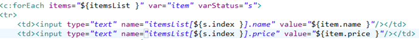

- 注释
  - itemList:controller方法形参包装类型中list的属性名。
  - itemList[0]或itemList[1]....，中[]中是序号，从0开始。
  - itemList[].name:name就是controller方法形参包装类型中list中pojo的属性名。
- 效果

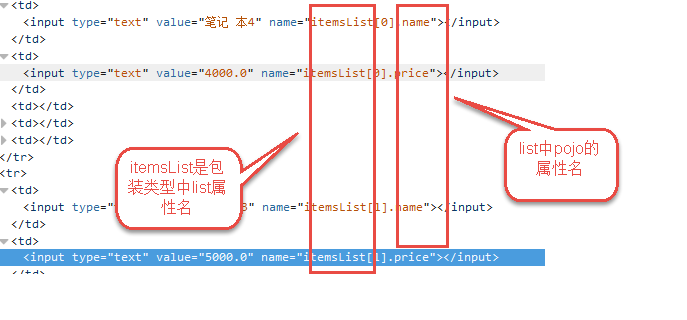

#### controller方法定义

- 使用包装类型接收页面批量提交的数据，绑定List。

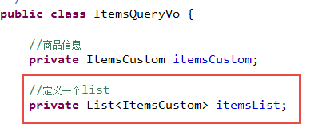

- controller方法定义

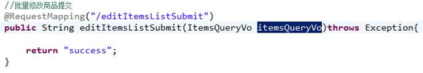

- 效果

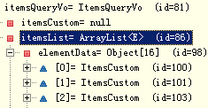

## SpringMVC和Struts的区别

- SpringMVC是**通过方法形参接收参数**，在使用时可以以单例方式使用，建议使用单例。
- Struts是**通过成员变量接收参数**，在使用时必须以多例方式使用。
- SpringMVC是基于方法开发，Struts基于类开发。
- SpringMVC将一个请求的Method和Handler进行关联绑定，一个method对应一个handler。
- SpringMVC开发以方法为单位进行开发，方法更贴近service（业务方法）。
- Struts标签解析速度比较慢，建议使用jstl。

## 商品图片上传

### 需求

- 在商品修改页面，增加图片上传功能。
- 操作流程
  - 用户进入商品修改页面
  - 上传图片
  - 点击提交（提交的是图片和商品信息）
  - 再次进入修改页面，图片在商品修改页面显示

### 图片存储问题

- 不要把图片上传到工程目录，不方便进行工程维护
- 实际电商项目中使用专门图片服务器（http，比如Apache、Tomcat）
- 本次使用图片虚拟目录，通过虚拟目录访问硬盘上存储的图片目录
- 虚拟目录设置

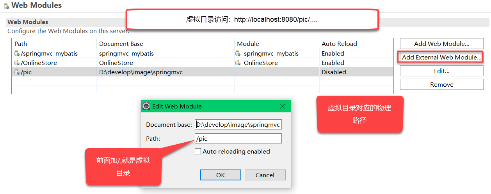

- 图片目录中尽量进行分级目录存储，提高访问速度（提高i/o）

### 配置图片上传解析器

- SpringMVC用的是MultipartFile来进行文件上传，所以首先要配置MultipartResolver用于处理表单中的file。

```xml
<!-- 文件上传,配置文件上传解析器 -->
    <bean id="multipartResolver" class="org.springframework.web.multipart.commons.CommonsMultipartResolver">
    	<!-- 设置上传文件的最大尺寸为5MB -->
    	<property name="maxUploadSize">
    		<value>5242880</value>
    	</property>
    	
    	<!-- 请求的编码格式，默认为ISO8859-1 -->
    	<property name="defaultEncoding">
    		<value>UTF-8</value>
    	</property>
    	
    	<!-- 指定上传文件的临时目录
    	<property name="uploadTempDir">
    		<value></value>
    	</property>
 		-->
    </bean>
```

- 属性讲解
  - maxUploadSize，文件上传大小，单位为字节
  - defaultEncoding，请求的编码格式，默认为ISO8859-1
  - uploadTempDir，上传文件的临时路径

#### 用到的jar包

- 加入commos-fileupload的jar包

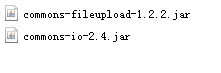

### 上传图片的页面

```jsp
<td>商品图片</td>
	<td>
		<c:if test="${item.pic != null}">
			
			<br/>
		</c:if>
		<input type="file"  name="pictureFile"/> 
	</td>
```

- 在form标签中还需要加上`enctype="multipart/form-data" `表示该表单要处理文件。

### 编写controller方法

```java
@RequestMapping(value = "/editItemSubmit",method = {RequestMethod.GET,RequestMethod.POST})
	public String editItemSubmit(Integer id,@ModelAttribute(value="item") ItemsCustom itemsCustom
			,ItemsQueryVo itemsQueryVo,MultipartFile pictureFile) throws Exception {
		
		
		//文件上传
		if(pictureFile != null) {
			
			//文件上传的路径
			String filePath = "D:\\develop\\image\\springmvc\\";
			
			//获取文件原始名称
			String OldFileName = pictureFile.getOriginalFilename();
			
			//设置新的文件名称
			String newFileName = UUID.randomUUID().toString() + OldFileName.substring(OldFileName.lastIndexOf("."));
			
			//新文件
			File file = new File(filePath + newFileName);
			
			//将文件写入磁盘，transferTo() 方法保存到一个目标文件中。即指定的磁盘路径
			pictureFile.transferTo(file);
			
			//设置商品图片的名称至数据库
			itemsCustom.setPic(newFileName);
		}
		
		
		
		//执行修改
		itemsService.updateItem(id, itemsCustom);
		//itemsService.updateItem(id, itemsQueryVo.getItemsCustom());
		
		//重定向，以为是在同一个根路径下，所以可以不用加根路径
		return "redirect:queryItems.action";
		
		//跳回到修改界面，查看数据回显
		//return "editItem";
		
		//转发
		//return "forward:queryItems.action";
	}
```

- MultipartFile pictureFileMultipartFile是spring的一个接口，通常我们可以在controller定义方法使用MultipartFile接收form表单提交的文件，然后将MultipartFile可以转化成一个文件。
- MultipartFile类常用的一些方法
  - `String getContentType()`获取文件MIME类型。
  - `InputStream getInputStream()`获取文件流。
  - `String getName()`获取表单中文件组件的名字。
  - `String getOriginalFilename`获取上传文件的原名。
  - `long getSize`获取文件的字节大小，单位byte。
  - `boolean isEmpty()`是否为空。
  - `void transferTo(File dest)`保存到一个目标文件中。该目标文件已经指定好文件路径，即写入本地磁盘。

## json数据交互

### 需求

json数据格式常用于远程接口传输，http传输json数据，方便页面进行提交/请求结构解析，对json数据的解析。

### SpringMVC解析json加入json解析包

**注意，Spring4和Spring3使用的json包有区别**

- Spring4
  - 默认使用MappingJackson2HttpMessageConverter对json数据进行转换，需要加入Jackson包如下

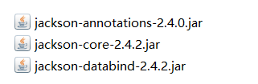

- Spring3
  - 默认使用MappingJacksonHttpMessageConverter 对json数据进行转换，需要加入Jackson包如下


### 在处理器适配器中注入MappingJackson2HttpMessageConverter

让处理器适配器支持json数据解析，需要注入MappingJackson2HttpMessageConverter

```xml
<bean class="org.springframework.web.servlet.mvc.method.annotation.RequestMappingHandlerAdapter">
    	<!-- 在注解适配器中注入Converter转换器 -->
    	<property name="webBindingInitializer" ref="customerBinder"/>
    	<!-- json解析器 -->
    	<property name="messageConverters">
    		<list>
    			<bean class="org.springframework.http.converter.json.MappingJackson2HttpMessageConverter"></bean>
    		</list>
    	</property>
    </bean>
```

### @RequestBody和@ResponseBody

- @RequestBody：将请求的json数据转成java对象。
- @ResponseBody：将java对象转成json数据输出。

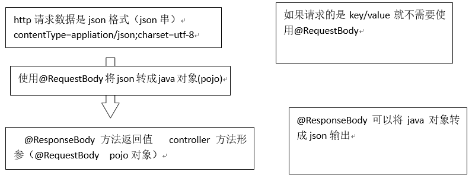

### 请求json响应json

#### controller方法

```java
/**
	 * 请求json，响应json，请求商品信息json数据，响应商品信息json数据
	 * @param itemsCustom
	 * @return
	 * @throws Exception
	 */
	@RequestMapping("/requestJson.action")
	public @ResponseBody ItemsCustom requestJson(@RequestBody ItemsCustom itemsCustom) throws Exception{
		
		
		return itemsCustom;
	}
```

#### 页面

```js
//请求json响应json
	function requestJson() {
		
		//不能使用$.post来实现了
		/* var url = "${pageContext.request.contextPath }/requestJson.action";
		var param = {"name" : "手机","price" : "30000"};
		
		$.post(url,param,function(data){
			alert(data);
		});	 */	
		
		//请求json，必须使用$.ajax，因为需要设置contentType="application/json;charset=UTF-8"
		$.ajax({
			url:"${pageContext.request.contextPath }/requestJson.action",
			type:"post",
			contentType:"application/json;charset=UTF-8",
			//注意，这里data的json格式，必须是里面双引号，否则400请求失败
			//参数名也必须是data，否则请求失败
			data:'{"name":"手机","price":"9000"}',
			success:function(data){
				alert(data);
			}
		});
	}
```

### 请求key/value响应json

#### controller方法

```java
/**
	 * 请求key/value，响应json
	 * @param itemsCustom
	 * @return
	 * @throws Exception
	 */
	@RequestMapping("/responseJson.action")
	public @ResponseBody ItemsCustom responseJson(ItemsCustom itemsCustom) throws Exception{
		
		
		return itemsCustom;
	}
```

#### 页面

```js
//请求key/value响应json
	function responseJson() {
		
		var url = "${pageContext.request.contextPath }/responseJson.action";
		var param = "name=手机&price=7000"
		
		$.post(url,param,function(data){
			alert(data.name);
		});		
	}
```

- 请求key/value时，可以使用$.post来完成，使用默认的contentType就可以。

### 小结

如果前端处理没有特殊要求，建议使用第二种，即请求key/value响应json方式，方便客户端解析请求结果。

## validation校验（了解）

- 对前端的校验大多数通过js在页面校验，这种方法比较简单，如果对安全性考虑，还要在后台校验。
- springmvc使用JSR-303（javaEE6规范的一部分）校验规范，springmvc使用的是hibernate validator（不是使用hibernate的ORM，这两者没关系）

### 加入Hibernate Validator的jar

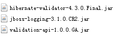

### 在处理器适配器中配置校验器

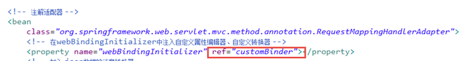

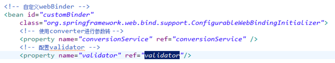

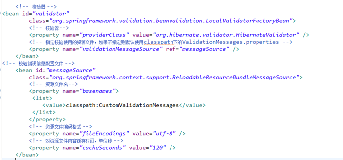

### 创建CustomValidationMessages

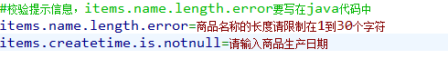

### 校验规则

- 需求：商品信息提交时校验，商品生产日期不能为空，商品名称长度在1至30字符之间。
- 在需要校验的pojo类中指定，这里使用注解，如下name属性和createtime属性。

```java
public class Items {
    private Integer id;

    //错误信息指定到对应字段
    @Size(min=1,max=30,message="{items.name.length.error}")
    private String name;

    private Float price;

    private String pic;

    @NotNull(message="{items.createtime.is.notnull}")
    private Date createtime;
```

### 捕获错误

修改controller方法，在要校验的pojo前加上@Validated

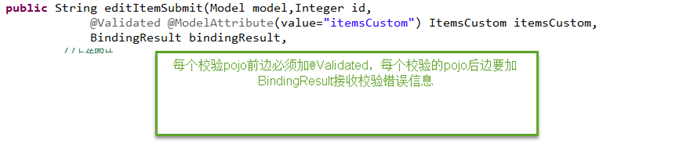

错误信息输出：

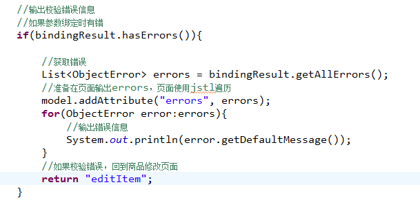

### 在页面上展示错误

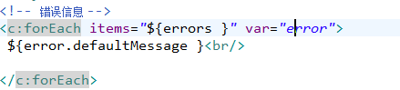

### 分组校验

- 需求：针对不同的controller方法通过分组校验达到个性化校验的目的，修改商品修改功能，只校验生产日期不能为空。

1. 创建分组接口

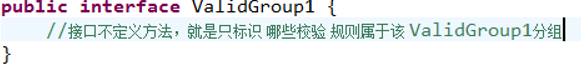

2. 定义校验规则属于哪个分组

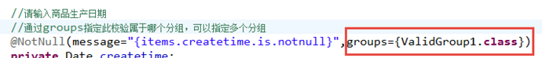

3. 在controller方法定义使用校验的分组

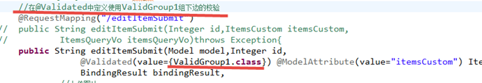

## 统一异常处理

### 需求

- 一般项目中都需要做异常处理，基于系统架构的设计考虑，使用统一的异常处理方法。
- 体系中异常类型
  - 包括预期可能发生的异常，运行时异常（RuntimeException），运行时异常不是预期会发生的。
  - 针对预期可能发生的异常，在代码手动处理异常可以try/catch捕获，可以向上抛出
  - 针对运行时异常，只能通过规范代码质量、在系统测试时详细测试等排除运行时异常。

### 统一异常处理解决方案

#### 定义异常

针对预期可能发生的异常，定义很多异常类型，这些异常类型通常继承于Exception。这里定义一个系统自定义异常类，用于测试。

```java
/**
 * 自定义异常类，异常类型通常继承于Exception。实际开发中可能需要定义许多自定义异常类
 * 该类的作用就是让程序员对于已知的错误，抛到这个类中，再由异常处理器去解决显示。
 * 对于未知的，比如运行时异常，通过异常处理器来转成该异常类，接收到异常信息，显示到界面中给用户看。
 * @author wwr
 *
 */
public class CustomException extends Exception {

	//异常信息
	private String message;
	
	public CustomException(String message) {
		
		super(message);
		this.message = message;
	}

	public String getMessage() {
		return message;
	}

	public void setMessage(String message) {
		this.message = message;
	}
}
```

#### 异常处理

- 在统一异常处理的类中处理系统抛出的所有异常，根据异常类型来处理。
- 前端控制器DispatcherServlet在进行HandlerMapping、调用HandlerAdapter执行Handle进行异常处理。

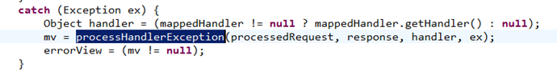

- 在系统中自定义统一的异常处理器，写系统自己的异常处理代码。

##### 定义统一异常处理器类

- 统一异常处理器类需要实现HandlerExceptionResolver接口。
- 系统自定义的异常类是CustomException异常，在controller方法中、service方法中**手动**抛出此类异常。
- 针对系统自定义的CustomException异常，可以直接从异常类中获取异常信息，将异常处理的信息在错误页面显示。
- 针对非CustomException异常，重新构造成一个CustomException，异常信息显示为“未知错误”，此类错误需要在系统测试阶段去排除。（运行时异常）

```java
/**
 * 自定义统一异常处理器
 * 该异常处理器在系统中只能出现一个，和异常类不一样
 * 该异常处理器类还需要在配置文件中定义
 * @author wwr
 *
 */
public class CustomExceptionResolver implements HandlerExceptionResolver {

	@Override
	/**
	 * 前端控制器DispatcherServlet在进行HandlerMapping、调用HandlerAdapter执行Handler过程中，如果遇到异常，
	 * 就会执行该方法。
	 * handler最终要执行的handler，真是身份是HandlerMethod
	 * ex接收到的异常信息
	 */
	public ModelAndView resolveException(HttpServletRequest request, HttpServletResponse response, Object handler,
			Exception ex) {
		
		//打印出异常
		ex.printStackTrace();
		
		//统一异常处理代码
		
		//异常信息
		String messgae = null;
		
		CustomException customException = null;
		
		//针对系统自定义的CustomException异常，可以直接从该异常类中获取异常信息，并展示在错误页面
		//如果ex是系统自定义异常，直接获取异常信息,即程序员手动抛出的
		if(ex instanceof CustomException) {
			customException = (CustomException) ex;
		}else {
			//针对非CustomException异常（比如运行时异常），则重新构造一个CustomException，错误信息为“未知错误”
			customException = new CustomException("未知错误！");
		}
		//获取错误信息
		messgae = customException.getMessage();
		
		//异常信息存至request域中
		request.setAttribute("messgae", messgae);
		
		try {
			//跳转至错误页面
			request.getRequestDispatcher("/WEB-INF/jsp/error.jsp").forward(request, response);
		} catch (ServletException e) {
			// TODO Auto-generated catch block
			e.printStackTrace();
		} catch (IOException e) {
			// TODO Auto-generated catch block
			e.printStackTrace();
		}
		
		return null;
	}

}
```

##### 配置

- 只需要在springmvc.xml中配置自定义的异常处理类就可以

```xml
<!-- 定义统一异常处理器 -->
    <bean class="vvr.ssm.exception.CustomExceptionResolver"/>
```

##### 测试抛出异常由统一异常处理器捕获

可以在controller方法、service方法、dao实现类中抛出异常，要求dao、service、controller遇到的异常**全部向上抛出异常**，方法向上抛出异常`throws Exception`

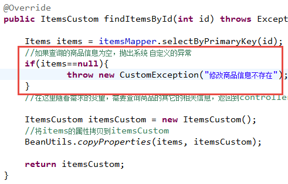

图解

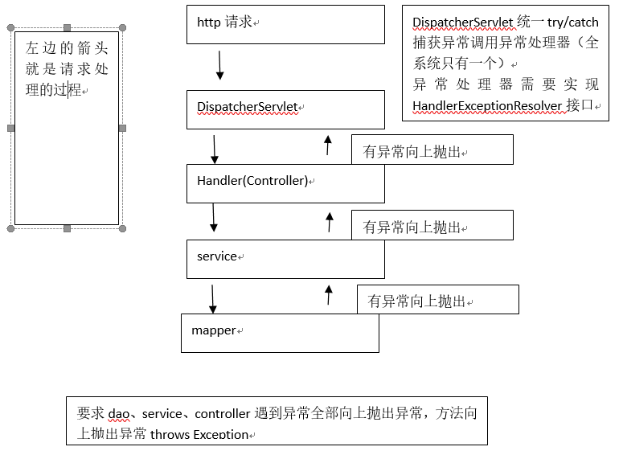

